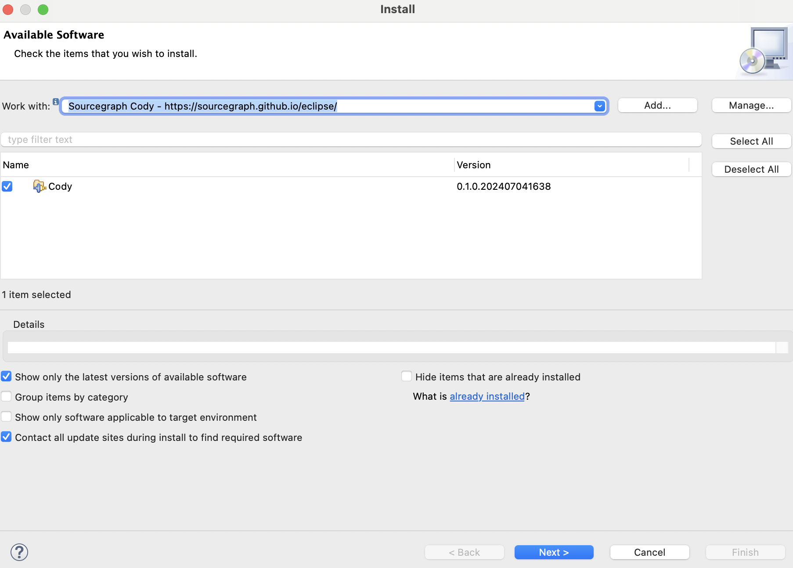
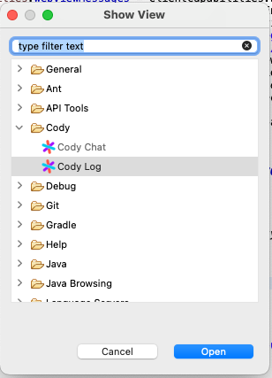
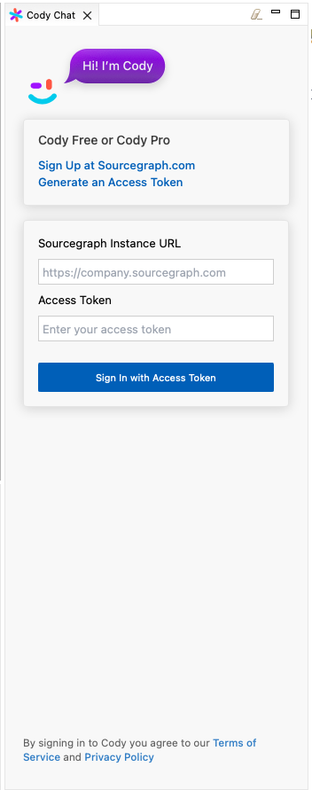
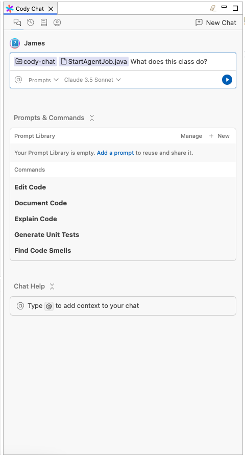
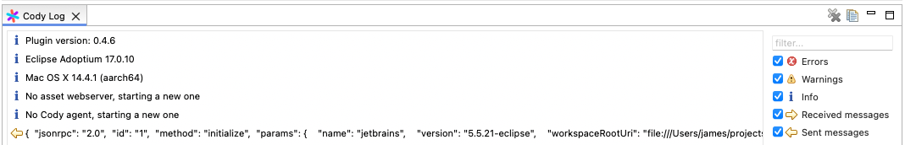

- [Development guide](docs/development.md)
aaaaaaaa
## Installing Cody for Eclipse

Currently the only version of Eclipse that Cody supports is Eclipse 2024-03 (4.31.0) on Windows 11.

First, open "Help > Install New Software"

Next, add the site URL https://sourcegraph.github.io/eclipse

If everything goes well, you should see the "Cody" category in the list of available plugins.

Click "Next" and follow the installation instructions.

After you have completed the installation and restarted Eclipse, you should see the "Cody" view in the "Window > Show View > Other" menu.

Once you open the "Cody" view, you should see a button to sign into your Sourcegraph account.

After you sign in, you'll see the Cody chat view and can begin chatting with your codebase!

# Troubleshooting

## _The first time I open Cody Chat, I just see a white screen_

This can happen if Eclipse prompted you to setup a password for secure storage and Cody timed out waiting. Simply close and re-open the Cody Chat.

## _In the error log, I see an error saying no password provided_
This can happen because the default OS password integration has been corrupted. Go to Preferences > General > Security > Secure Storage and ensure your OS integration is checked. Then click Clear Passwords at the top, and then click "Change Password". If you see a dialog saying "An error occurred while decrypting stored values... Do you want to cancel password change?" Click "No."

This will reset the secure storage master password in the OS integration. You will be asked if you want to provide additional information for password recovery, which is optional.
Click "Apply and Close" and restart Eclipse. 

## _General Tips_

You can open the Cody Log view using the same steps as above, but instead selecting Cody Log.

This will include quite a bit of information about what Cody is doing, including any errors. There is a copy button at the top right of the log view that you can use to copy the log to your clipboard and sent to us. Be careful not to include any sensitive information as the log communication is verbose and may contain tokens.

Additionally, Eclipse's built-in Error Log can be used to view any uncaught exceptions and view their stack traces. You can open the Error Log using the "Window > Show View > Error Log" menu.
