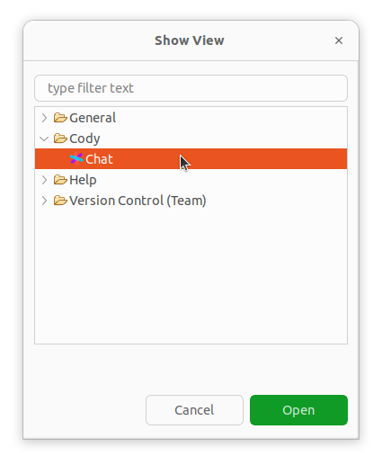

# Development guide

## Prerequisites

- Eclipse IDE for Eclipse Committers
  The project was created with version 2024-03. It can be downloaded from [here](https://www.eclipse.org/downloads/packages/release/2024-03/r/eclipse-ide-eclipse-committers). 

## Importing cloned repository into a lokal workspace

- Open Eclipse and select a path to a place you want to create your local workspace.
- From `File` select `Import`.
- In the pop-up select the `General` category and from it `Existing Projects into Workspace`.
  
- On the next page choose `Select root directory` then using `Browse` open the root directory of this repository.
- Three projects should appear. Make sure that all are selected and click `Finish`

## Running and debugging the plugin

To run the project for the first time, right click on `minimal_run.launch` file in the `Cody Feature` project. From the context menu select `Run as` then `1. minimal_run`. You will be asked whether to clear the workspace data. If you want to preserve settings and files from the previous run select `Don't clear`.

After running the project once, the launch configuration will be added to the run and debug menus in the toolbar.

If you can open the Cody Chat view from `Window > Show view > Other`, the plugin is loaded properly.

## Manual build

Open `site.xml` file from the `Cody Update Site` project. In the `Site Map` editor tab click the `Build All` button.

This will re-generate all the files in the `Cody Update Site` project. It is now a complete update site. It can be used to install the plugin on any eclipse instance.

## Maven build

// TODO 

## Opening the project in IntelliJ

// TODO

## Debugging and testing the project on different versions of Eclipse

// TODO