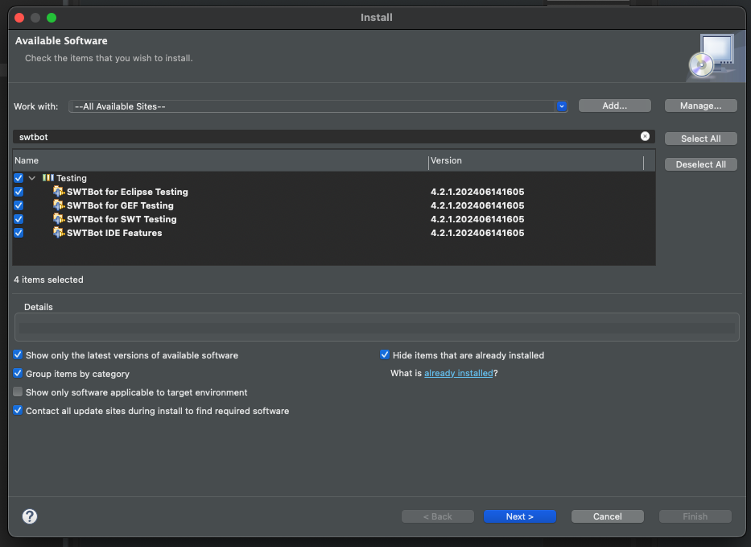
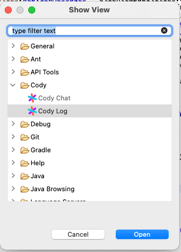

# Development guide

## Prerequisites

- Windows or Linux computer. The plugin itself can be installed on any platform,
  but the debug build inside Eclipse does not work on Apple Silicon macOS.
- Eclipse IDE for Eclipse Committers The project was created with version
  2024-03. It can be downloaded from
  [here](https://www.eclipse.org/downloads/packages/release/2024-03/r/eclipse-ide-eclipse-committers).
- SWTBot plugin for Eclipse. It can be installed in Eclipse `Help > Install New
  Software...` or from the update site: `https://download.eclipse.org/technology/swtbot/releases/latest/`.



## Importing cloned repository into a lokal workspace

- Open Eclipse and select a path to a place you want to create your local
  workspace.
- From `File` select `Import`.
- In the pop-up select the `General` category and from it
  `Existing Projects into Workspace`. 
- On the next page choose `Select root directory` then using `Browse` open the
  root directory of this repository.
- Select "Search for nested projects" and uncheck the root "eclipse" project (important to uncheck, otherwise you get build errors).
  
- Three projects should appear. Make sure that all are selected and click
  `Finish`

## Running and debugging the plugin

To run the project for the first time, right click on `minimal_run.launch` file
in the `Cody Feature` project. From the context menu select `Run as` then
`1. minimal_run`. You will be asked whether to clear the workspace data. If you
want to preserve settings and files from the previous run select `Don't clear`.

After running the project once, the launch configuration will be added to the
run and debug menus in the toolbar.


If you can open the Cody Chat view from `Window > Show view > Other`, the plugin
is loaded properly.



## Manual build

Open `site.xml` file from the `Cody Update Site` project. In the `Site Map`
editor tab click the `Build All` button.


This will re-generate all the files in the `Cody Update Site` project. It is now
a complete update site. It can be used to install the plugin on any eclipse
instance.


## Bazel build and import into IntelliJ IDEA

This repo has an optional Bazel build that enables the following:

- Build the plugin for different versions of Eclipse (2019-12, 2022-12, 2024-03)
- Import the plugin codebase into IntelliJ IDEA

The steps to import the 2024-03 version of the plugin into IntelliJ IDEA are as
follows:

1. Create a symlink to the `plugins/` directory of local your Eclipse
   installation. For example,
   `ln -svf /Applications/Eclipse.app/Contents/Eclipse/plugins eclipse-platforms/eclipse-2024-03-jars`.
2. Validate you can build the plugin locally by running
   `bazel build //:cody_eclipse_2024_03`. This step needs to succeed to move on
   to the next step.
3. Run the script `python scripts/bazel-sources.py` to generate a single jar
   file containing the source code from Eclipse. This step makes "Go to
   definition" show the Eclipse source code in IntelliJ.
4. Install the
   ["Bazel for IntelliJ"](https://plugins.jetbrains.com/plugin/8609-bazel-for-intellij)
   plugin from the JetBrains Marketplace.
5. Run the "Import Bazel Project" action from IntelliJ.
6. Select the workspace directory.
7. Select the "Import project view" option and select the file
   "2024-03.bazelproject". 

## Updating MANIFEST.MF

We use Bazel to automate releases. The motivation for this is that we couldn't
figure out how to build the plugin outside the Eclipse GUI otherwise. There
exists maven-tycho, but we're not using it for a variety of reasons (including
the lack of IntelliJ support).

Long-story short, mostly everything works with Bazel-built releases **except**
how we handle `MANIFEST.MF`. When you need to update `MANIFEST.MF`, you need to
do this proces

```sh
# Copy the original MANIFEST.MF
cp plugins/cody-chat/META-INF/MANIFEST.MF.original plugins/cody-chat/META-INF/MANIFEST.MF
# Make the change on the original manifest
# Build the plugin manually in the Eclipse GUI via `site.xml`, "synchronze", "add feature", "build"
unzip -j unzip -j releng/cody-update-site/plugins/cody-chat_0.100.0.*.jar META-INF/MANIFEST.MF
# Make a backup copy of the original manifest
cp plugins/cody-chat/META-INF/MANIFEST.MF plugins/cody-chat/META-INF/MANIFEST.MF.original
# Move the generated manifest into the official location
mv MANIFEST.MF plugins/cody-chat/META-INF/MANIFEST.MF
# Manually edit the generated manifest to use version 0.100.0.qualifier
```


## Fixing secret storage errors on macOS

When running the plugin on macOS, you may hit on this error here
```
Secure storage was unable to retrieve the master password from the OS keyring. Make sure that this application has access to the OS keyring. If the error persists, the password recovery feature could be used, or secure storage can be deleted and re-created.
```

Here is [one relevant result](https://www.eclipse.org/forums/index.php/t/1098516/) showing the fix for this problem.
The short fix:

* Quit Eclipse
* Run `codesign -f -s - /Applications/Eclipse.app/Contents/MacOS/eclipse`
* Run `rm -rf ~/.eclipse/org.eclipse.equinox.security/secure_storage`
* Start Eclipse again

